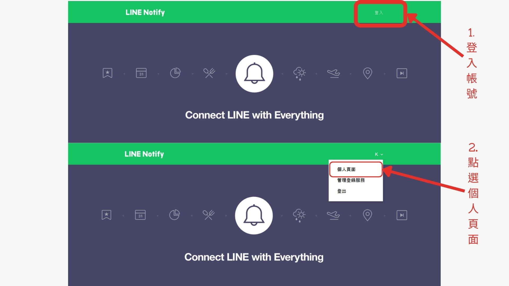
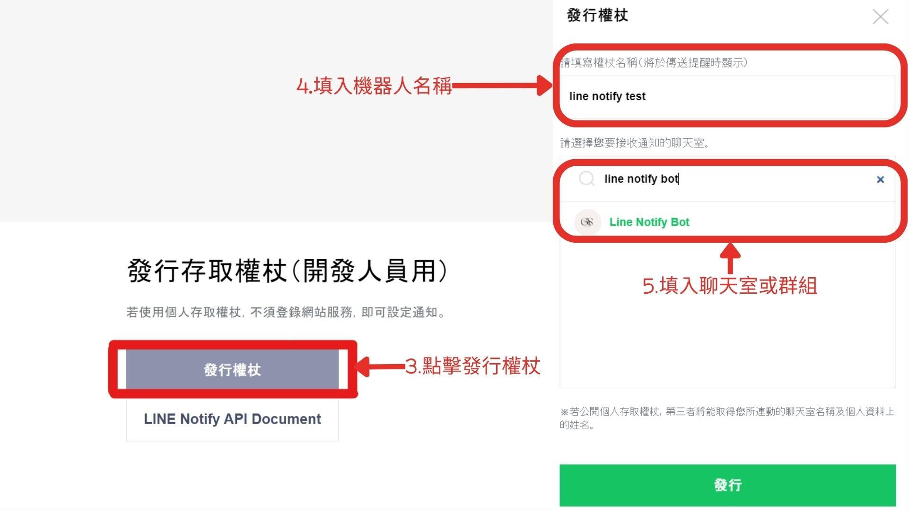
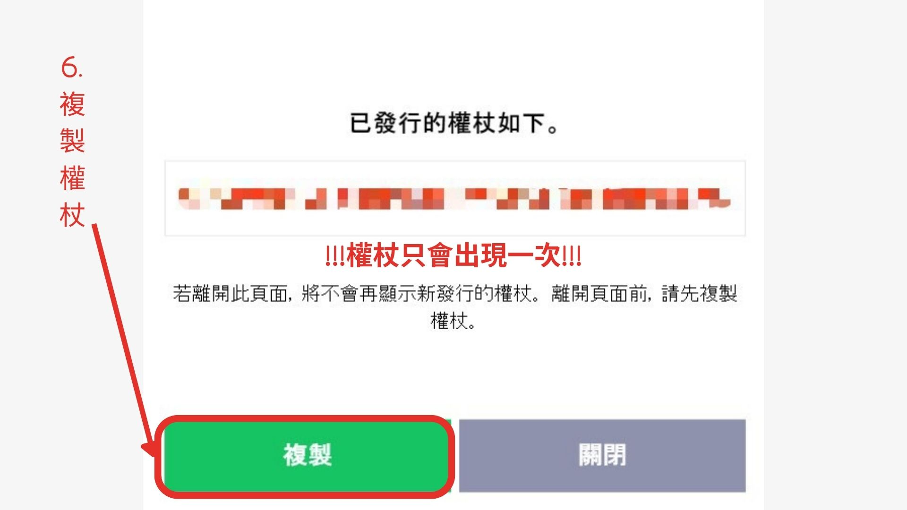
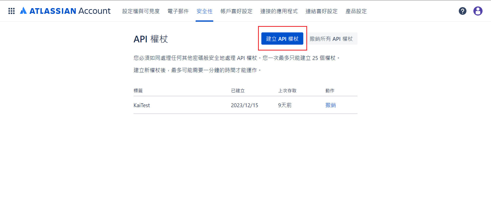
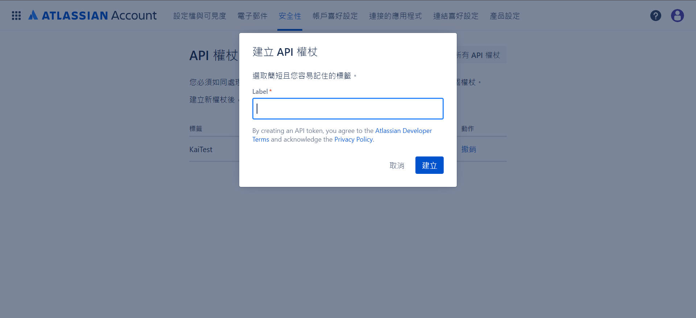
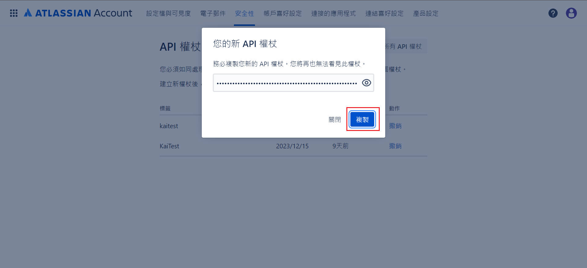

# ISD整合LINE Notify 專案架構

## 1. 介紹

### 1.1 專案目的

- 本專案目的為整合ISD與LINE Notify，讓使用者可以透過LINE Notify發送訊息給ISD，並且ISD可以將訊息傳送給使用者。
- 本專案使用的是LINE Notify的API，因此使用者必須先申請LINE Notify的權限，才能使用本專案。
- 本專案使用的是ISD的API，因此使用者必須先申請ISD的**Admin**權限，才能使用本專案。

## 2. 使用說明

### 2.1 關於 config.yml

```
# input your line_notify_token
line_notify_token: ''

# input your isd_api_token
ISD_api_token: ''

# input your isd_api_username
username: ''
```

- line_notify_token: 請填入您的 LINE Notify Token。
- ISD_api_token: 請填入您的 ISD API Token。
- username: 請填入您的 ISD 帳號。

### 2.2 關於 LINE Notify Token

1. #### 前往 https://notify-bot.line.me/en/ 並使用您的 Line 帳號登錄。

2. #### 點擊「個人頁面」 > 發行權杖。

   

3. #### 填入機器人名稱和聊天室名稱，並點擊生成權杖。

   

4. #### 複製權杖並**填入 config.yml** 檔案中。

   

### 2.3 關於 ISD API Token

1. #### 前往 https://id.atlassian.com/manage-profile/security/api-tokens 並使用您的 Atlassian 帳號登錄。
2. #### 點擊「建立API權杖」。
   
3. #### 輸入名稱並點擊「建立」。
    
4. #### 複製權杖並**填入 config.yml** 檔案中。
    

## 3 架構說明

### 3.1 about line_notify_api.py

- line_notify_api.py 是用來發送訊息給使用者的程式。

### 3.2 about isd_api.py

- isd_api.py 是用來接收訊息的程式。

### 3.3 about config.yml

- config.yml 是用來存放使用者的 LINE Notify Token、ISD API Token、ISD 帳號的檔案。

### 3.4 about utilites.py

- utilites.py 是用來存放一些常用的函式。

### 3.5 about main.py

- main.py 是用來執行程式的檔案。

### 3.6 將 line_notify_api.py 與 isd_api.py 併入 main.py

- 將 line_notify_api.py 與 isd_api.py 併入 main.py。
    - import line_notify_api.py
    - import isd_api.py
    - 使用 : line_notify_api.py.你的function()
    - 使用 : isd_api.py.你的function()

### 3.7 將config.yml資料同步至main.py

- 將config.yml資料同步至其他檔案。
    - import config.yml
  ```
   import utilities as utils
  # read config
   config = utils.read_config()
   ISD_api_token = config.get('ISD_api_token')
   line_notify_token = config.get('line_notify_token')
   username = config.get('username')
   ```

### 3.8 新增config變數

#### !!需要改三個地方!!

1. Config.yml

 ```
      # input your line_notify_token
       line_notify_token: ''
      
       # input your isd_api_token
       ISD_api_token: ''
      
       # input your isd_api_username
       username: ''
    
       # add new_parameter
       new_parameter: ''
```

2. utilities.py:config_file_generator()

```
       def config_file_generator():
       """Generate the template of config file"""
       with open('config.yml', 'w', encoding="utf8") as f:
               f.write("""# ++--------------------------------++
         # | Made by KXX (MIT License)        |
         # ++--------------------------------++
          
         # input your line_notify_token
         line_notify_token: ''
          
         # input your isd_api_token
         ISD_api_token: ''
          
         # input your isd_api_username
         username: ''
      
         # add new_parameter
         new_parameter: ''
          
         #-------------------------------------
        
         """
                     )
         sys.exit()
```

3. utilities.py:read_config()

```
def read_config():
    """Read the config file.
    Check if the config file exists, if not, create one.
    If it exists, read the config file and return the configuration as a dictionary.
    :rtype: dict
    """
    if not exists('./config.yml'):
        print("Config file not found, creating one by default.\nPlease finish filling config.yml")
        config_file_generator()

    try:
        with open('config.yml', 'r', encoding="utf8") as f:
            data = yaml.load(f, Loader=SafeLoader)
            config = {
                'line_notify_token': data.get('line_notify_token'),
                'ISD_api_token': data.get('ISD_api_token'),
                'username': data.get('username'),
                'new_parameter': data.get('new_parameter')
            }
            return config
    except (KeyError, TypeError):
        print(
            "An error occurred while reading config.yml. Please check if the file is correctly filled.\n"
            "If the problem can't be solved, consider deleting config.yml and restarting the program.\n")
        sys.exit()

```

修改完成後即可在main.py中使用
